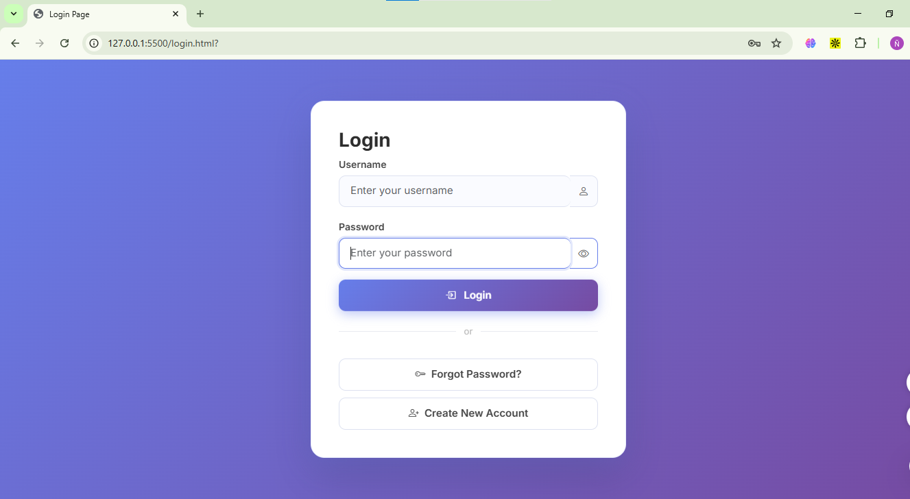
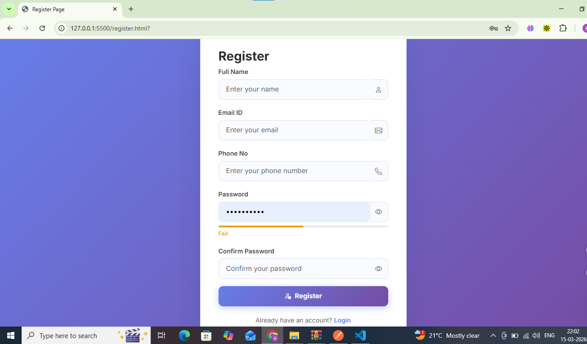
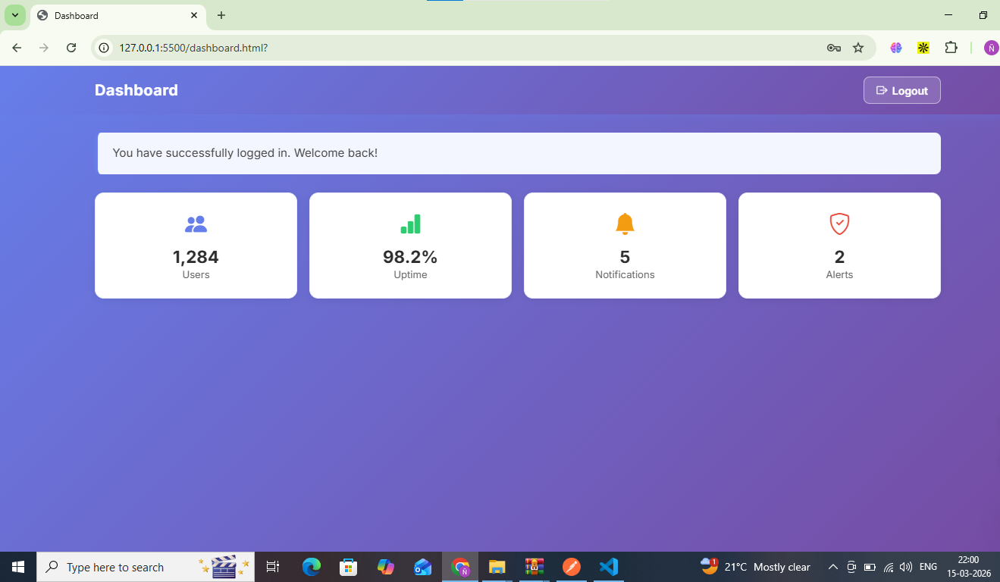

# Authentication System — Styled

A professional, responsive authentication UI built with **Bootstrap 5**, **Bootstrap Icons**, and **custom CSS** using **Google Fonts (Inter)**.

## Pages

| Page | File |
|------|------|`
| Login | `login.html` |
| Register | `register.html` |
| Forgot Password | `forgot-password.html` |
| Reset Password | `reset-password.html` |
| Dashboard | `dashboard.html` |

## Features

- Bootstrap 5 card components on all auth pages
- Bootstrap form controls (`form-control`, `form-label`) with proper `for`/`id` pairing
- Bootstrap Icons on all inputs and buttons
- Show / Hide password toggle on Login, Register, and Reset Password
- Password strength indicator on Register page (Weak → Fair → Good → Strong)
- Loading spinner on Login button click
- Responsive Bootstrap navbar on Dashboard with collapsible mobile menu
- Dashboard stats grid (4 cards) using Bootstrap grid (`col-6 col-md-3`)
- Fully responsive: Mobile (320px+), Tablet (768px+), Laptop (1366px+), Desktop (1920px+)
- Fade-in animation on page load
- Google Font: **Inter** (400 / 500 / 600 / 700)
- Custom color scheme with CSS variables (`--primary`, `--primary-dark`, etc.)
- Smooth transitions and hover effects on cards, buttons, and links
- Box shadows on cards with hover lift effect
- Background gradient on all pages

## Project Structure

```
html-authentication-poc-main/
├── login.html
├── register.html
├── forgot-password.html
├── reset-password.html
├── dashboard.html
├── styles.css
├── README.md
└── screenshots/
    ├── login.png
    ├── register.png
    ├── forgot-password.png
    ├── reset-password.png
    └── dashboard.png
```

## Tech Stack

- HTML5
- Bootstrap 5.3.2
- Bootstrap Icons 1.11.3
- Google Fonts — Inter
- Custom CSS (styles.css)

## Screenshots

### Login Page


### Register Page


### Forgot Password Page


### Reset Password Page


### Dashboard Page


## Author

Naveen Kumar R
Fullstack Java Development — Assignment 2
Institution: CampusPe | Mentor: Jacob Dennis
